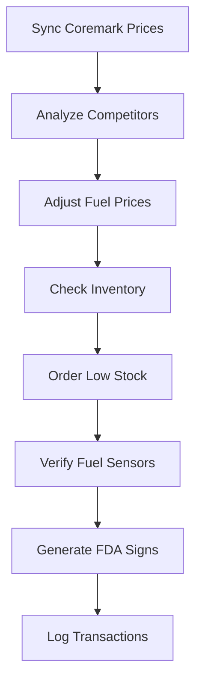

#** README** for ;
AMPM ALN-POS-System. 
- Proper markdown formatting  
- Fixed syntax and code block issues  
- Clarified section organization  
- Enhanced clarity, compliance, and contributor instructions  

***

# AMPM ALN-POS-System

Autonomous Retail Management Solution for AMPM Site #42445  
**Location:** 7849 N 43rd Ave, Phoenix, AZ 85051, Maricopa County, USA


- [Key Features](#key-features)
- [Technical Specifications](#technical-specifications)
- [Compliance & Security](#compliance--security)
- [Installation](#installation)
- [Operational Workflow](#operational-workflow)
- [Monitoring & Maintenance](#monitoring--maintenance)
- [Contributing](#contributing)
- [License & Contact](#license--contact)
- [Appendix: Age Restriction Policy](#appendix-age-restriction-policy)

***

## Overview

The **AMPM ALN-POS-System** is an advanced, autonomous retail management platform custom-built for AMPM convenience store #42445. Designed to streamline operations, enforce regulatory compliance, and optimize profitability, it integrates key hardware components, software modules, and APIs within a unified ecosystem.  
Leveraging the Adaptive Logic Network (ALN) programming language, the system enables real-time decision-making for inventory, pricing, and compliance workflows.

***

## Key Features

- **Strict Age Restriction Enforcement (21+ Only)**
  - Restricted categories: alcohol, tobacco (cigarettes, cigars, vaping), accessories (lighters), lottery tickets.
  - Automated ID scanning (OCR), manual override, and transaction blocking for non-compliance.
  - Comprehensive audit trail: logs customer age, verification method, employee ID, and timestamp.
- **Dynamic Pricing Engine**
  - Fuel prices adjust automatically using GasBuddy competitor feeds and Arizona state tax rates.

```powershell
function DynamicFuelPricing {
  $competitor_prices = Invoke-RestMethod "https://api.gasbuddy.com/v1/az/phoenix/42445/competitors"
  $state_tax = Get-AZFuelTaxRate
  $optimal_price = [math]::Round(($competitor_prices.Lowest - 0.03) + $state_tax, 2)
  $clover = New-Object -ComObject Clover.POS.API
  $clover.SetPrice("FUEL_REG", $optimal_price)
  Write-EventLog -LogName "AMPM" -Source "Pricing" -Message "Fuel price set to $optimal_price"
}
```

- **Inventory Automation**
  - Low stock detection and automated ordering via Coremark API.

```powershell
function Update-Inventory {
  $inventory = Invoke-Sqlcmd -Query "EXEC sp_GetLowStockItems @StoreId=42445" -ServerInstance ".\SQLEXPRESS"
  $lowStock = $inventory | Where-Object { $_.Qty -lt $_.MinStock }
  $lowStock | ForEach-Object {
    $body = @{ sku = $_.SKU; quantity = ($_.MaxStock - $_.Qty) } | ConvertTo-Json
    Invoke-RestMethod -Method Post -Uri "https://api.coremark.com/v3/orders" -Body $body
  }
}
```

- **Fuel Sensor Calibration**
  - Monitors and recalibrates Veeder-Root fuel sensors if drift exceeds 0.5%.

```powershell
function Calibrate-FuelSensors {
  $sensors = Get-Content "C:\AMPM\config\fuel_sensors.json" | ConvertFrom-Json
  $calibrationData = & "C:\Program Files\Veeder-Root\CLI.exe" get-calibration
  $sensors | ForEach-Object {
    $tankData = $calibrationData | Where-Object { $_.TankId -eq $_.Id }
    if ($tankData.Drift -gt 0.5) {
      & "C:\Program Files\Veeder-Root\CLI.exe" recalibrate --tank $_.Id
      Write-EventLog -LogName "AMPM" -Source "FuelSystem" -Message "Tank $_.Id recalibrated"
    }
  }
}
```

- **FDA Compliance Signage**
  - Auto-generates signage for tobacco sales per compliance.

```powershell
function Generate-FDASign {
  param($product, $price)
  $c = New-Object -ComObject ReportLab.Canvas
  $c.drawString(100, 750, "FDA REQUIRED NOTICE: AGE 21+")
  $c.drawString(100, 700, "$product: `$$price")
  $c.save("C:\AMPM\signage$product.pdf")
  Start-Process -FilePath "lpr" -ArgumentList "C:\AMPM\signage$product.pdf"
}
```

***

## Technical Specifications

### Hardware Integration

| Device        | Interface     | Protocol   | Command/Setup                                 |
|---------------|--------------|------------|-----------------------------------------------|
| Veeder-Root   | COM4 (RS-232)| ASCII      | COM4 BAUD=9600 PARITY=n DATA=8                |
| Pricer ESL    | Ethernet     | TCP/IP     | Enable via `netsh interface set ...` command  |
| Toru Robot    | REST API     | HTTPS      | `curl -X POST http://192.168.1.50/api/pick`   |
| Clover Flex   | COM+ DCOM    | Windows    | `regsvr32 /s C:\Clover\CloverCOM.dll`         |

### Software Stack

- OS: Windows Server 2019
- Database: Microsoft SQL Server 2019 Express
- Languages: PowerShell 7.2, Python 3.9
- APIs: Coremark v3, GasBuddy v1, Clover COM

***

## Compliance & Security

- **Age Restriction Policy (21+):**
  - Applies to all alcohol, tobacco, accessories, and lottery ticket sales.
  - Enforced through ALN scripting:
```lisp
(module age_restrictions
  (rule (restrict_sales
    (when (or (attempted_sale "alcohol")
              (attempted_sale "tobacco")
              (attempted_sale "lottery")
              (attempted_sale "lighter"))
    (do
      (require_id_scan)
      (if (customer_age < 21)
        (block_transaction)
        (log_violation "UNDERAGE_ATTEMPT" fields=[customer_id, product, timestamp])
        (trigger_alert "Underage sale blocked" severity=CRITICAL))
      (else
        (log_transaction "APPROVED" fields=[customer_age, verification_method, employee_id])
      )
    ))
  )
)
```
- **Regulatory Compliance**
  - FDA: 21 CFR §1143.5 (tobacco signage & age verification)
  - Arizona: Title 4 (fuel & alcohol sales)
  - Security: AES-256 data at rest, TLS 1.3 API calls

***

## Installation

**Prerequisites:**

- Hardware: Veeder-Root TLS-450, Clover Flex, Pricer ESL tags
- Software:  
  ```
  choco install python powershell-core mssql-server-2019
  pip install requests pandas reportlab
  ```
- API keys: Store in `C:\AMPM\config\keys.json`

**Steps:**
```bash
git clone https://github.com/ampm-aln/pos-system.git C:\AMPM\POS
cd C:\AMPM\POS
powershell -File install.ps1
```

***

## Operational Workflow



***

## Monitoring & Maintenance

**Key Metrics:**

| Metric              | Target   | Alert Threshold |
|---------------------|----------|----------------|
| Age Verification    | 100%     | <100%          |
| Fuel Price Drift    | <0.5%    | ≥0.5%          |
| Inventory Accuracy  | 99%      | <95%           |

**Schedule:**

| Task               | Frequency  | Responsible    |
|--------------------|------------|---------------|
| Sensor Calibration | Monthly    | Tech Team     |
| Compliance Check   | Weekly     | Store Manager |
| Software Updates   | Quarterly  | SysAdmin      |

***

## Contributing

- **Pull Requests:**  
  Submit to `main` with clear, detailed comments.

- **Issues:**  
  Use the template provided in `ISSUE_TEMPLATE.md`.

***

## License & Contact

**License:** Proprietary (AMPM #42445)

**Contact:**  
- Primary: [xboxteejaymcfarmer@gmail.com](mailto:xboxteejaymcfarmer@gmail.com)  
- Coremark: [cm_phx@coremark.com](mailto:cm_phx@coremark.com)  
- Veeder-Root: [support@veeder-root.com](mailto:support@veeder-root.com)

***

## Appendix: Age Restriction Policy

A strict zero-tolerance policy is enforced for sales of alcohol, tobacco, accessories (such as lighters), and lottery products to individuals under 21. Compliance is automated in the ALN script above, ensuring persistent adherence to local and federal regulations.

***

**For further information or contributions, please see [GitHub repository](https://github.com/Doctor0Evil/AMPM/tree/main#ampm-aln-pos-system).**
